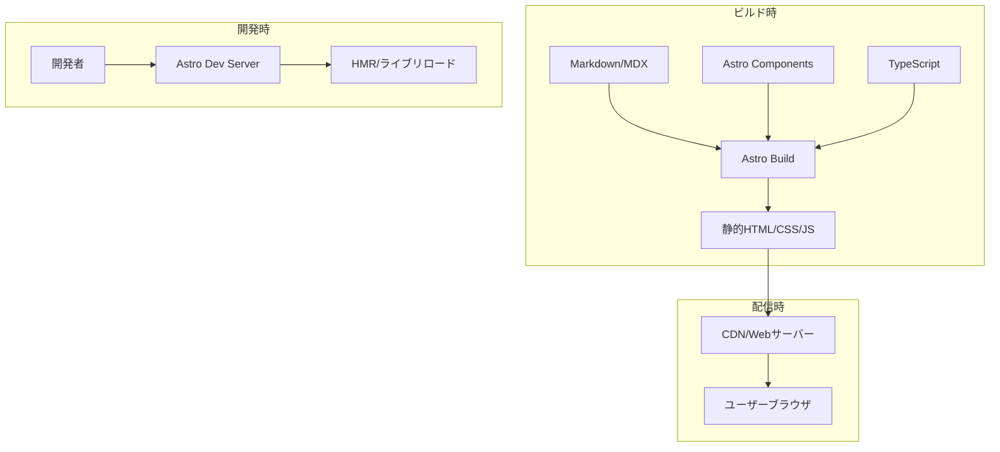
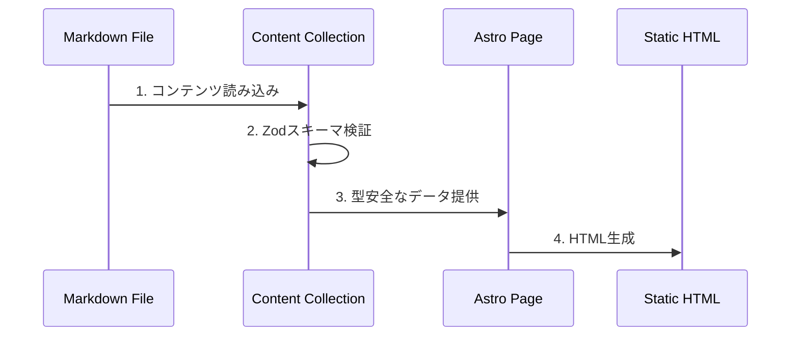
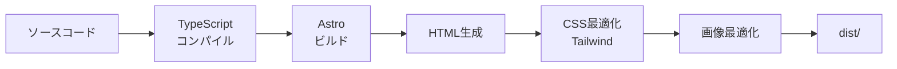

# アーキテクチャ概要

## システムアーキテクチャ

JHA Websiteは、Astroフレームワークを基盤とした静的サイトジェネレーター（SSG）アーキテクチャを採用しています。



## 主要な設計原則

### 1. 静的サイト生成 (SSG)
- **ビルド時にHTMLを生成**: パフォーマンスの最大化
- **CDN配信に最適化**: 世界中から高速アクセス
- **SEO最適化**: 完全にレンダリングされたHTML

### 2. コンポーネントベース設計
- **Astroコンポーネント**: `.astro`ファイルによる効率的なコンポーネント
- **再利用性**: 共通UIパーツのコンポーネント化
- **関心の分離**: 機能ごとにディレクトリを分割

### 3. コンテンツファースト
- **Markdownベース**: 技術者以外でも編集可能
- **型安全なコンテンツ**: Zodスキーマによる検証
- **フロントマター**: メタデータの構造化

## ディレクトリ構造

```
src/
├── pages/                  # ルーティング（ファイルベース）
│   ├── index.astro        # ホームページ
│   ├── about-us.astro     # 協会について
│   ├── topic/             # ニュース・トピック
│   │   ├── index.astro
│   │   └── [slug].astro   # 動的ルート
│   ├── hunter-house/      # ハンターハウス
│   │   ├── index.astro
│   │   └── [slug].astro
│   └── reports/           # 年次報告
│       └── index.astro
│
├── components/            # UIコンポーネント
│   ├── base/             # 基本コンポーネント
│   │   ├── Header.astro
│   │   ├── Footer.astro
│   │   └── Navigation.astro
│   ├── top/              # トップページ用
│   ├── topic/            # トピック用
│   ├── house/            # ハウス用
│   └── service/          # サービス用
│
├── layouts/              # レイアウトテンプレート
│   ├── BaseLayout.astro  # 基本レイアウト
│   └── MarkdownLayout.astro
│
├── content/              # コンテンツコレクション
│   ├── config.ts        # コレクション定義
│   ├── topic/           # ニュース記事
│   │   └── *.md
│   └── house/           # ハウス情報
│       └── *.md
│
├── i18n/                # 国際化
│   ├── utils.ts        # i18nユーティリティ
│   └── ui.ts           # 翻訳定義
│
├── styles/              # グローバルスタイル
│   └── global.css      # Tailwind設定
│
└── assets/              # 静的アセット
    └── images/         # 画像ファイル
```

## データフロー

### 1. コンテンツ処理フロー



### 2. ビルドプロセス



## レイヤードアーキテクチャ

### プレゼンテーション層
- **Pages**: ルーティングとページ構造
- **Components**: 再利用可能なUIパーツ
- **Layouts**: 共通レイアウト

### ビジネスロジック層
- **Utils**: ユーティリティ関数
- **i18n**: 多言語対応ロジック
- **Module**: ビジネスロジックモジュール

### データ層
- **Content Collections**: 構造化コンテンツ
- **Static Assets**: 画像・ファイル

## パフォーマンス最適化

### ビルド時最適化
- **静的生成**: 事前レンダリング
- **画像最適化**: 自動リサイズ・フォーマット変換
- **CSS最小化**: Tailwind CSSのパージ

### 配信時最適化
- **CDN活用**: エッジサーバーからの配信
- **キャッシュ戦略**: 適切なCache-Control設定
- **圧縮**: gzip/brotli圧縮

## セキュリティ考慮事項

### 静的サイトの利点
- **攻撃対象面の最小化**: サーバーサイド処理なし
- **XSS対策**: ビルド時のサニタイズ
- **依存関係管理**: npm auditによる脆弱性チェック

### ベストプラクティス
- Content Security Policy (CSP) の設定
- HTTPSの強制
- 定期的な依存関係の更新

## スケーラビリティ

### 水平スケーリング
- **CDN**: グローバル配信ネットワーク
- **静的ファイル**: 無限にスケール可能

### コンテンツ管理のスケール
- **Markdownファイル**: GitHubでバージョン管理
- **画像管理**: 最適化済みアセット

## 技術的決定事項

### なぜAstroか？
1. **高パフォーマンス**: JavaScriptの最小化
2. **開発体験**: モダンな開発環境
3. **柔軟性**: 複数のUIフレームワーク対応

### なぜSSGか？
1. **速度**: 事前生成による高速配信
2. **コスト**: サーバーレス運用可能
3. **セキュリティ**: 攻撃対象の最小化

### なぜTailwind CSS？
1. **開発速度**: ユーティリティファースト
2. **一貫性**: デザインシステムの構築
3. **最適化**: 未使用CSSの自動削除

## 今後の拡張可能性

- **CMS統合**: HeadlessCMSの導入
- **動的機能**: Astro Islandsによる部分的インタラクティビティ
- **API統合**: 外部サービスとの連携
- **PWA化**: オフライン対応

---

最終更新: 2025年1月