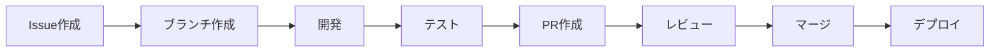

# 開発ワークフロー

## 開発フロー概要



## ブランチ戦略

### ブランチ構成
```
main            # 本番環境
├── develop     # 開発環境
    ├── feature/*   # 新機能開発
    ├── fix/*       # バグ修正
    ├── refactor/*  # リファクタリング
    └── docs/*      # ドキュメント更新
```

### ブランチ命名規則
```bash
# 新機能
feature/add-user-authentication
feature/implement-search-function

# バグ修正
fix/header-navigation-bug
fix/mobile-layout-issue

# リファクタリング
refactor/optimize-image-loading
refactor/update-component-structure

# ドキュメント
docs/update-readme
docs/add-api-documentation
```

## 開発の流れ

### 1. Issue作成・確認

```markdown
## 概要
ヘッダーナビゲーションのモバイル表示が崩れる

## 再現手順
1. モバイル端末でサイトにアクセス
2. ハンバーガーメニューをタップ
3. メニューが正しく表示されない

## 期待する動作
メニューが適切にドロップダウン表示される

## 環境
- デバイス: iPhone 12
- ブラウザ: Safari 15
```

### 2. ブランチ作成

```bash
# developブランチから作成
git checkout develop
git pull origin develop
git checkout -b fix/mobile-navigation-issue

# または一行で
git checkout -b fix/mobile-navigation-issue origin/develop
```

### 3. 開発作業

#### コンポーネント作成
```astro
---
// src/components/NewComponent.astro
export interface Props {
  title: string;
  description?: string;
}

const { title, description } = Astro.props;
---

<div class="component">
  <h2>{title}</h2>
  {description && <p>{description}</p>}
</div>

<style>
  .component {
    @apply p-4 bg-white rounded-lg shadow;
  }
</style>
```

#### ページ作成
```astro
---
// src/pages/new-page.astro
import Layout from '@/layouts/Layout.astro';
import { getCollection } from 'astro:content';

const posts = await getCollection('topic');
---

<Layout title="新しいページ">
  <main>
    <h1>ページタイトル</h1>
    <!-- コンテンツ -->
  </main>
</Layout>
```

### 4. ローカルテスト

```bash
# 開発サーバーで確認
npm run dev

# 型チェック
npm run astro check

# ビルドテスト
npm run build

# ビルド結果の確認
npm run preview
```

### 5. コミット

#### コミットメッセージ規約
```bash
# 形式: <type>: <subject>

# 新機能
feat: ユーザー認証機能を追加

# バグ修正
fix: モバイルナビゲーションの表示崩れを修正

# ドキュメント
docs: README.mdを更新

# スタイル変更
style: コードフォーマットを統一

# リファクタリング
refactor: コンポーネント構造を最適化

# パフォーマンス改善
perf: 画像読み込みを最適化

# テスト
test: ユーザー認証のテストを追加

# ビルド/CI
build: webpack設定を更新
ci: GitHub Actionsワークフローを追加

# その他
chore: 依存関係を更新
```

#### コミット例
```bash
# ステージング
git add .

# または選択的に
git add src/components/NewComponent.astro
git add src/pages/new-page.astro

# コミット
git commit -m "feat: 新しいコンポーネントを追加"

# 詳細なメッセージの場合
git commit -m "fix: モバイルナビゲーションの表示崩れを修正

- ハンバーガーメニューのz-indexを調整
- ドロップダウンアニメーションを改善
- タッチイベントの処理を最適化"
```

### 6. プッシュ

```bash
# リモートにプッシュ
git push origin fix/mobile-navigation-issue

# 初回プッシュの場合
git push -u origin fix/mobile-navigation-issue
```

### 7. プルリクエスト作成

#### PRテンプレート
```markdown
## 概要
このPRで解決する問題や追加する機能の説明

## 変更内容
- [ ] 変更点1
- [ ] 変更点2
- [ ] 変更点3

## テスト
- [ ] ローカルでの動作確認
- [ ] ビルドの成功
- [ ] 型チェックの通過

## スクリーンショット
変更前:


変更後:


## 関連Issue
Closes #123
```

### 8. コードレビュー

#### レビューポイント
- [ ] コーディング規約の遵守
- [ ] パフォーマンスへの影響
- [ ] アクセシビリティ
- [ ] レスポンシブデザイン
- [ ] 国際化対応
- [ ] セキュリティ

#### レビューコメント例
```markdown
# 提案
ここではuseMemoを使用してパフォーマンスを改善できます。

# 必須修正
このコードはXSS脆弱性があります。サニタイズが必要です。

# 質問
この処理の意図を教えてください。
```

### 9. マージ

```bash
# developへのマージ（GitHub上で実行）
# Squash and mergeを推奨

# ローカルでの更新
git checkout develop
git pull origin develop
```

## 日常的なタスク

### コンテンツ追加

#### 新しい記事の追加
```markdown
---
# src/content/topic/new-article.md
title: "新しい記事タイトル"
pubDate: 2025-01-27
tags: ["ニュース", "お知らせ"]
author: "著者名"
image: "/images/article-image.jpg"
---

記事の本文...
```

#### 画像の追加
```bash
# 画像を適切なディレクトリに配置
cp image.jpg public/images/

# またはアセットとして
cp image.jpg src/assets/images/
```

### コンポーネント更新

```bash
# 既存コンポーネントの編集
code src/components/Header.astro

# 新規コンポーネントの作成
touch src/components/NewFeature.astro
```

### スタイル調整

```css
/* Tailwind クラスの追加 */
<div class="p-4 md:p-6 lg:p-8">

/* カスタムCSSの追加 */
<style>
  .custom-class {
    @apply bg-gradient-to-r from-orange-400 to-red-500;
  }
</style>
```

## デバッグ手法

### ブラウザデバッグ
```javascript
// コンソールログ
console.log('Debug:', variable);

// ブレークポイント
debugger;

// Astroコンポーネント内
---
console.log('Server-side log:', data);
---
```

### VS Codeデバッグ設定
```json
// .vscode/launch.json
{
  "version": "0.2.0",
  "configurations": [
    {
      "type": "node",
      "request": "launch",
      "name": "Debug Astro",
      "runtimeExecutable": "npm",
      "runtimeArgs": ["run", "dev"],
      "console": "integratedTerminal"
    }
  ]
}
```

## パフォーマンス確認

### Lighthouse実行
```bash
# CLIで実行
npx lighthouse http://localhost:4321 --view

# 特定の項目のみ
npx lighthouse http://localhost:4321 --only-categories=performance
```

### バンドルサイズ確認
```bash
# ビルド後のサイズ確認
npm run build
du -sh dist/

# 詳細な分析
npx vite-bundle-visualizer
```

## チームコラボレーション

### コミュニケーション
- Issue: 機能要望・バグ報告
- PR: コードレビュー・議論
- Wiki: 長期的なドキュメント
- Slack/Discord: リアルタイムコミュニケーション

### ペアプログラミング
```bash
# VS Code Live Share
# 拡張機能をインストール後
# Ctrl/Cmd + Shift + P → "Live Share: Start"
```

### 知識共有
- 週次の技術共有会
- コードレビューでの学習
- ドキュメントの継続的更新

## 自動化

### pre-commitフック
```json
// package.json
{
  "husky": {
    "hooks": {
      "pre-commit": "npm run astro check",
      "pre-push": "npm run build"
    }
  }
}
```

### GitHub Actions
```yaml
# .github/workflows/ci.yml
name: CI
on: [push, pull_request]
jobs:
  test:
    runs-on: ubuntu-latest
    steps:
      - uses: actions/checkout@v4
      - run: npm ci
      - run: npm run build
      - run: npm run test
```

## ベストプラクティス

### DRY原則
- コンポーネントの再利用
- ユーティリティ関数の共通化
- 設定の一元管理

### KISS原則
- シンプルな実装を優先
- 過度な抽象化を避ける
- 読みやすいコードを書く

### レスポンシブファースト
```astro
<div class="w-full md:w-1/2 lg:w-1/3">
  <!-- モバイルファーストで設計 -->
</div>
```

### アクセシビリティ
```astro
<button 
  aria-label="メニューを開く"
  aria-expanded={isOpen}
>
  <span class="sr-only">メニュー</span>
</button>
```

---

最終更新: 2025年1月